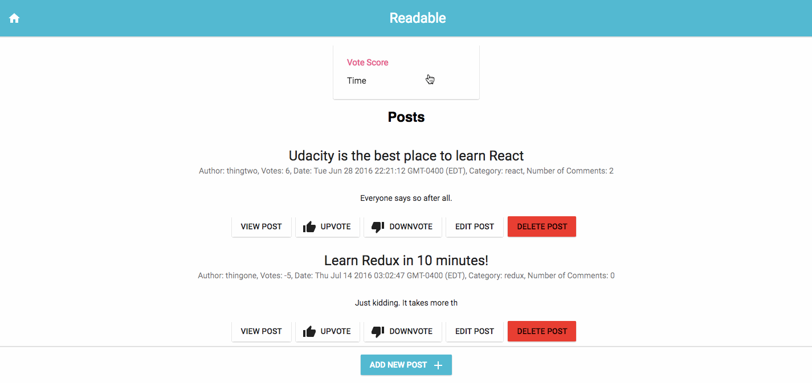
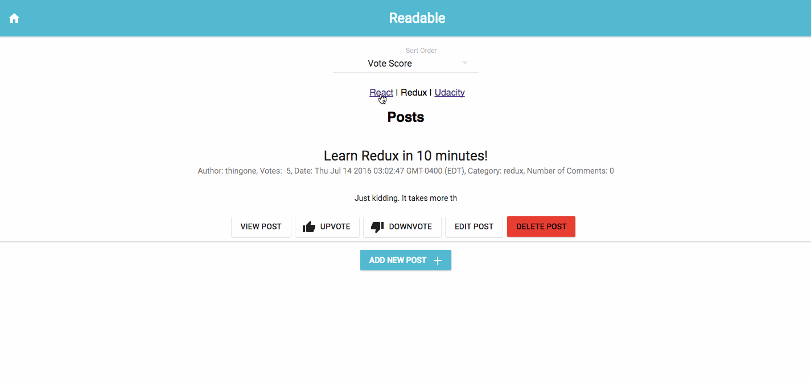

## Readable

Readable is a web application that allows visitors to post articles and allows other visitors to comment and vote on these on the articles. There's also the ability to vote on the comments as well. The posts and comments can be sorted via the "Sort Order" drop-down on the top of the Posts and Comments Views. Articles can be filtered by category by clicking on the respective category links at the top of the page.

To start this application please download this code base via git clone or download. Once downloaded, navigate to the directory and run the commands below in your terminal. The application will open automatically in your default browser.

```npm install && npm start```

You will also need to start the backend server where the application's data will be stored. Instructions can be found [here](https://github.com/udacity/reactnd-project-readable-starter).

### Sorting posts
Use Sort Dropdown to sort posts and comments


### Selecting category
Selecting a category from the top will filter posts by that category


## Create React App

This project was bootstrapped with [Create React App](https://github.com/facebookincubator/create-react-app).

Below you will find some information on how to perform common tasks.<br>
You can find the most recent version of this guide [here](https://github.com/facebookincubator/create-react-app/blob/master/packages/react-scripts/template/README.md).

## Material-UI

This project was styled using [Material-UI](https://github.com/callemall/material-ui)
